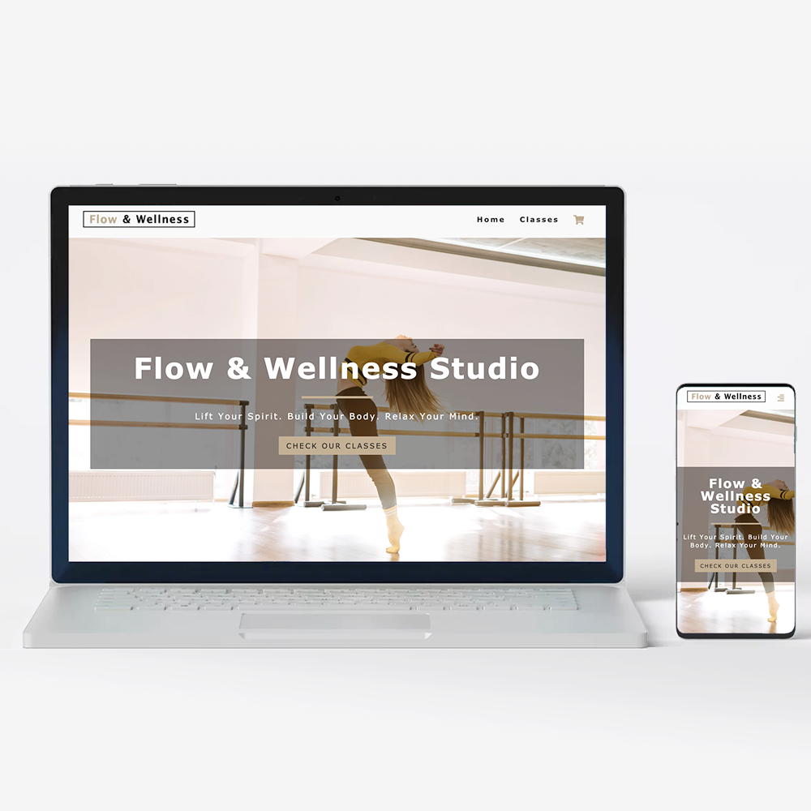
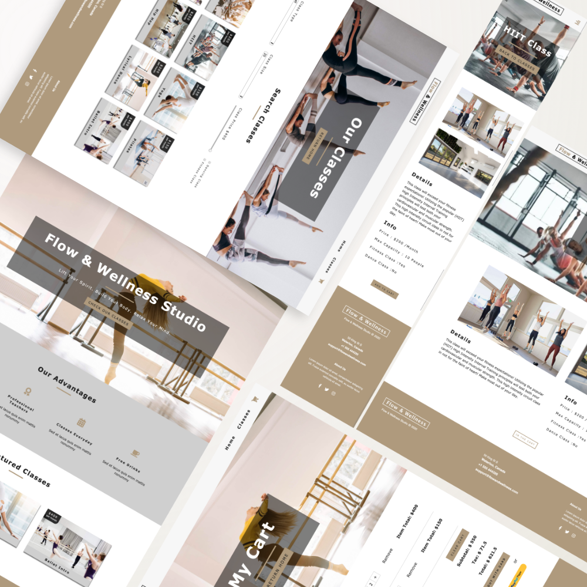

This project was bootstrapped with [Create React App](https://github.com/facebook/create-react-app).

## Live demo

https://flowandwellnessstudio.netlify.com/

This is a full-frontend SPA shopping Web App for choosing and purchasing studio classes, created with React. The development includes a landing page with featured products and services, a product page with classes listing and filtering, a product description page, a shopping cart with checkout function (Paypal or cards). Customized API and responsive design are also applied for faster and better user experience.

## Tech:
React: State & Lifecycle Management, Router DOM, Context (Provider, Consumer), React Icon, Hook (State, Effect), Event Handler, etc.

HTML/CSS: Structure and Responsive Design

Contentful: Content Management & Data Retrieve

Paypal & Stripe: Payment Management

